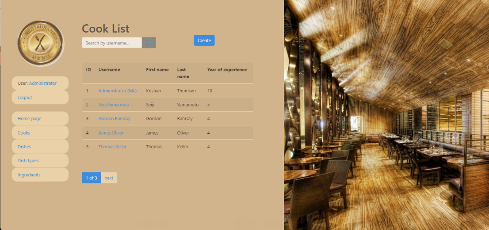

# Restaurant Service Project

Django project for managing local restaurant with cooks, dish types, dishes and also ingredients to dishes in the kitchen.

## Check it out!

[Restaurant Service project deployed to Render](PAST_LINK_HERE)

## Installation

Python3 must be already installed

```shell
git clone https://github.com/Viktor-Beniukh/py-restaurant-service.git
cd py-restaurant-service
python3 -m venv venv
source venv/bin/activate
pip install -r requirements.txt
python manage.py runserver   # starts Django Server
```

## Features

* Authentication functionally for Cook/User
* Managing cooks, dish types, dishes and ingredients to dishes directly from website
* Powerful admin panel for advanced managing

## Demo


